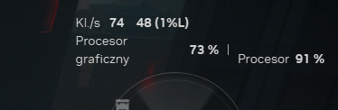

# ControlResonant-SSDLimiter

This is a dirty hack that limits asset streaming in CONTROL Resonant which will reduce stutters on CPU-limited systems.

## What this actually does

This is a DLL swap-based hook that injects `Sleep()` calls inbetween `ReadFile` calls. The game's engine streams in almost gigabytes of data every second, which hammers the CPU a lot, causing stutters.

This isn't a game-specific patch which means in theory this should also work with other games having similar issues (could try this on Alan Wake 2?).

## Will this fix stuttering problems (improve 1% lows, etc.)

If you're CPU-limited it likely will.  
If you're GPU-limited it likely won't make a difference.

On my 6-core i5 machine (i5-9600KF + RTX 2080) the difference was massive, the game went from a stutterfest dropping to 15 FPS at times to perfectly playable 60 in most areas, often even above that.  
I don't know just how much but I've also heard that this improves performance on a quad-core Ryzen 3 3200G.

Before:  


After:  


## The downsides

- You might see some more texture pop-in
- Audio might cut out sometimes (but with the default configuration this shouldn't happen often)
- Loading might be slightly slower (for me it went from 15 to 20 seconds)

## Configuration

The mod creates an `ssdlimiter.cfg` file on launch, which you can edit to change some of the values if you'd like to experiment.

```ini
[SSDLimiter]
; Wait every <n> bytes read:
wait_threshold=1000000
; Wait <n> MS:
wait_duration=1
```